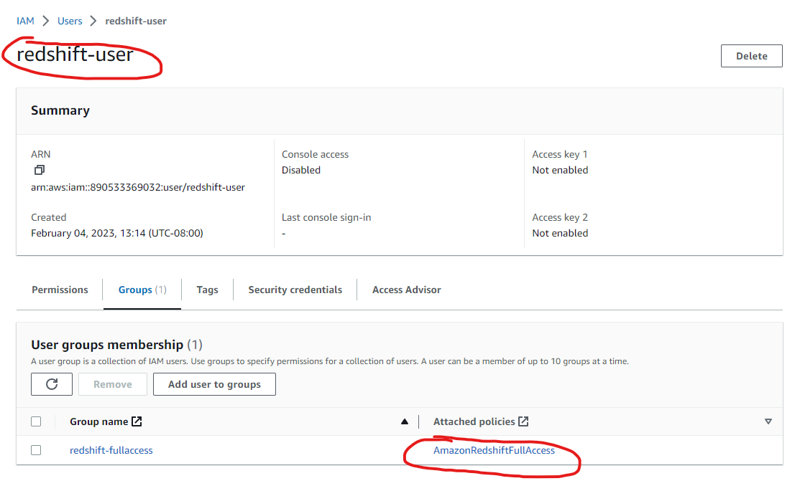
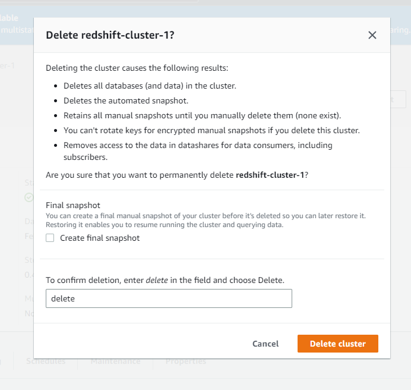

### Problem Scenario
Company wants to deploy a scalable data warehouse for analyzing huge
amount of data within fraction of minutes using BI tools. Use Amazon
Redshift, as it allows you to deploy a scalable data warehouse to analyze
your data right away using your existing BI tools.
### Objective:
Create and configure an Amazon Redshift data warehouse, load sample
data, and analyze it using an SQL client.

### Steps to perform:
1. Create a role for Redshift in the IAM console

2. Create an Amazon Redshift cluster
3. Configure the cluster by choosing instance type and specify the
number of nodes

4. Connect to the cluster through SQL tool and execute the queries
5. Load the sample data from S3 after creating the tables and schema
definition
6. Analyze the data with a standard SQL of SQL tool

7. Clean up the resources
