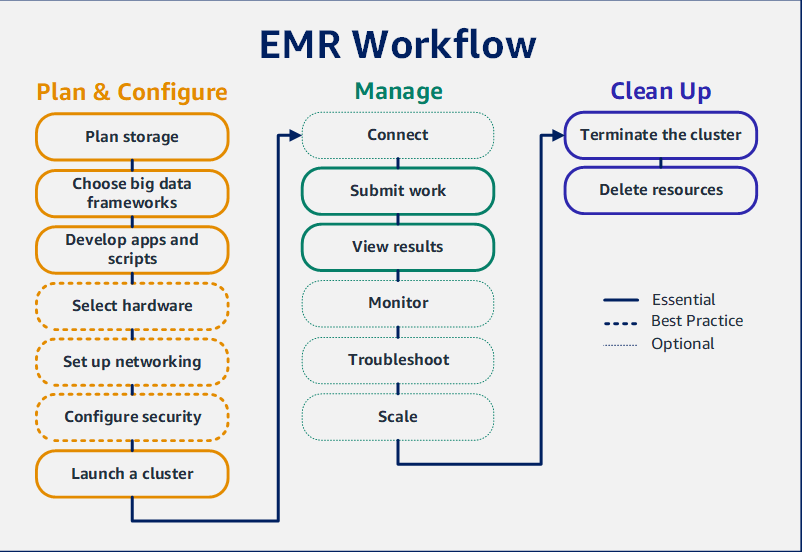
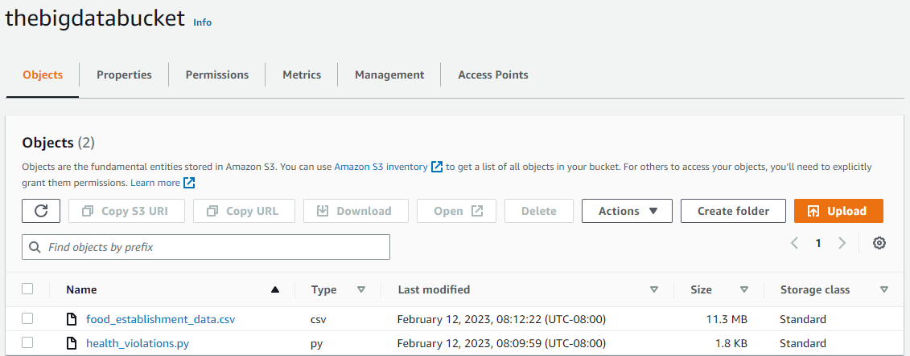
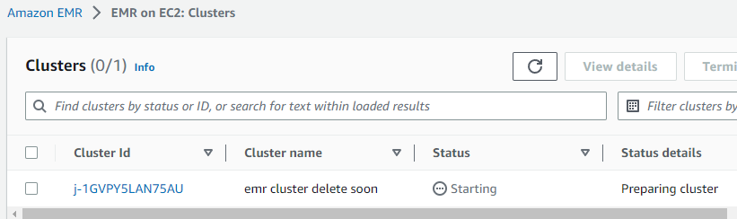
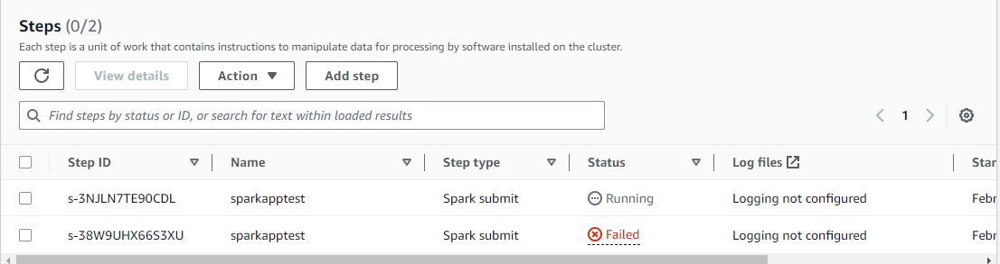
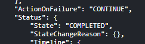
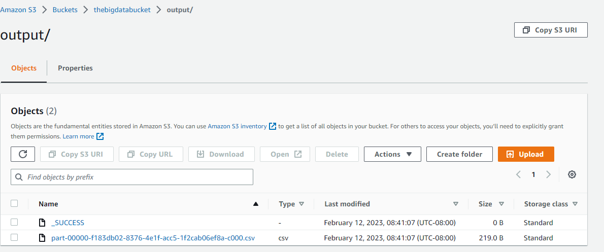
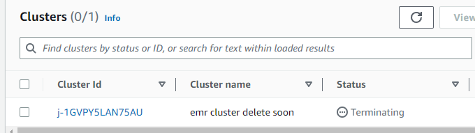

Source: https://docs.aws.amazon.com/emr/latest/ManagementGuide/emr-gs.html
# Setting up Amazon EMR

## Create an Amazon EC2 key pair for SSH

1.Use the 'create-key-pair' commands as follows to generate the key pair and save the private key to a .pem file

    aws ec2 create-key-pair \
    --key-name my-key-pair \
    --key-type rsa \
    --key-format pem \
    --query "KeyMaterial" \
    --output text > my-key-pair.pem

--key-name = Name for public key
--key-type = rsa or ed25519 (rsa is default if this option is not included)
--key-format = pem or ppl (pem is default)
--query "KeyMaterial" = prints the key to ouput
--output text > 'filename.pem' = is the file out name

# Getting started with Amazon EMR

## Overview

With Amazon EMR you can set up a cluster to process and analyze data with big data frameworks in just a few minutes. This tutorial shows you how to launch a sample cluster using Spark, and how to run a simple PySpark script stored in an Amazon S3 bucket. It covers essential Amazon EMR tasks in three main workflow categories: Plan and Configure, Manage, and Clean Up

## Step 1: Plan and configure an EMR cluster
### Prepare storage for Amazon EMR

When using EMR, a variety of file systems can be chosen for storing: input data, output data, and log files.

In this tutorial, data will be stored using EMRFS on an S3 bucket

EMRFS: an implementation of the Hadoop file system that lets you read and write regular files to Amazon S3

Buckets and folders that you use with Amazon EMR have the following limitations:
_Names can consist of lowercase letters, numbers, periods (.), and hyphens (-).
_Names cannot end in numbers.
_A bucket name must be unique across all AWS accounts.
_An output folder must be empty

    aws s3 mb s3://thebigdatabucket --region us-west-2

### Prepare an application with input data for Amazon EMR

The most common way to prepare an application for EMR is to upload the application and its input data to S3. Then, you simply just need to submit work to the cluster with the specified S3 location of scripts and data

In this step, upload a sample PySpark script as well as the sample input data to S3

### Launch an EMR cluster

1. Create IAM Default roles that you can use you create a cluster

        aws emr create-default-roles

2. Create a Spark cluster using commands

        aws emr create-cluster \
        --name "<My First EMR Cluster>" \
        --release-label <emr-5.36.0> \
        --applications Name=Spark \
        --ec2-attributes KeyName=<myEMRKeyPairName> \
        --instance-type m5.xlarge \
        --instance-count 3 \
        --use-default-roles		

3. Check cluster status

        aws emr describe-cluster --cluster-id <myClusterId>

## Step 2: Manage EMR cluster

### Submit work to EMR

After launching a cluster, submit work to the running cluster to process and analyze data. Submit work on EMR as a 'step'

A step is a unit of work made up of one or more actions. For example, you might submit a step to compute values or to transfer and process data

You can submit steps when you create a cluster, or to a running cluster

### Submit a Spark app as a step with AWS CLI

1. Make sure you have ClusterId of the cluster

        aws emr list-clusters --cluster-states WAITING

2. Submit spark application as a step with 'add-steps' command

        aws emr add-steps \
        --cluster-id <myClusterId> \
        --steps Type=Spark,Name="<My Spark Application>",ActionOnFailure=CONTINUE,Args=[<s3://DOC-EXAMPLE-BUCKET/health_violations.py>,--data_source,<s3://DOC-EXAMPLE-BUCKET/food_establishment_data.csv>,--output_uri,<s3://DOC-EXAMPLE-BUCKET/MyOutputFolder>]							

3. Query status of your step using the describe-step command

        aws emr describe-step --cluster-id <myClusterId> --step-id <s-1XXXXXXXXXXA>							

### View results

## Step 3: Clean up your EMR resouces

### Terminate the cluster with AWS CLI

1. Initiate cluster termination

        aws emr terminate-clusters --cluster-ids <myClusterId>

2. Check that termination is done

        aws emr describe-cluster --cluster-id <myClusterId>	

Note: Amazon EMR saves metadata about terminated clusters for your reference for two months, after which the metadata is deleted.

### Delete S3 resources
