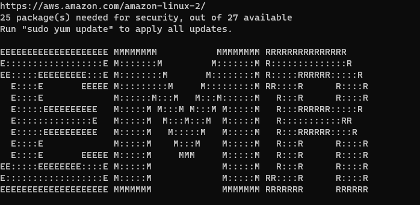
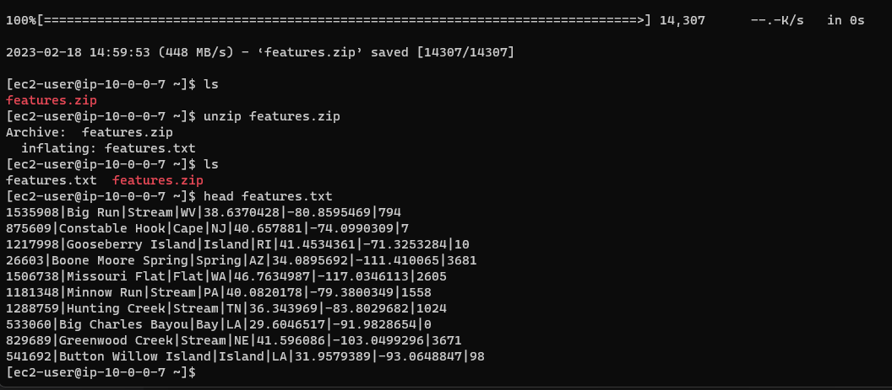
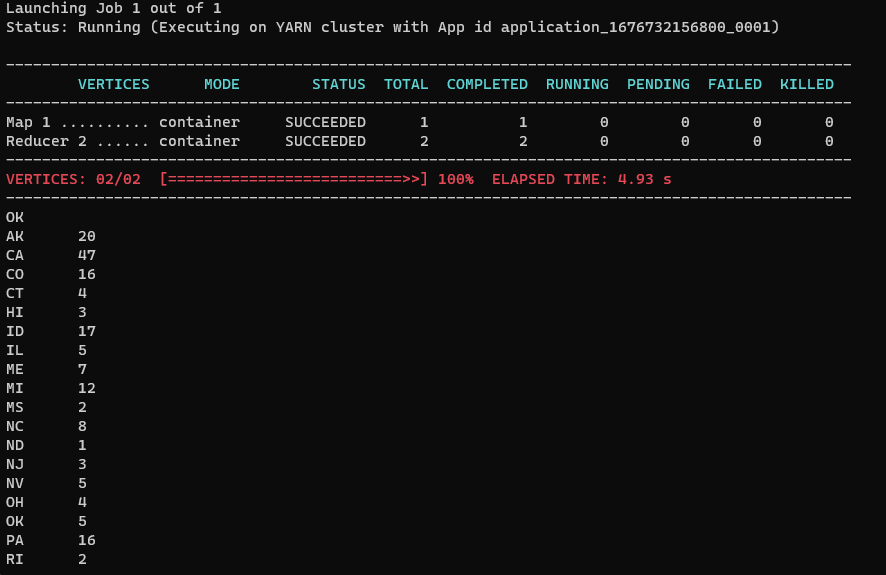
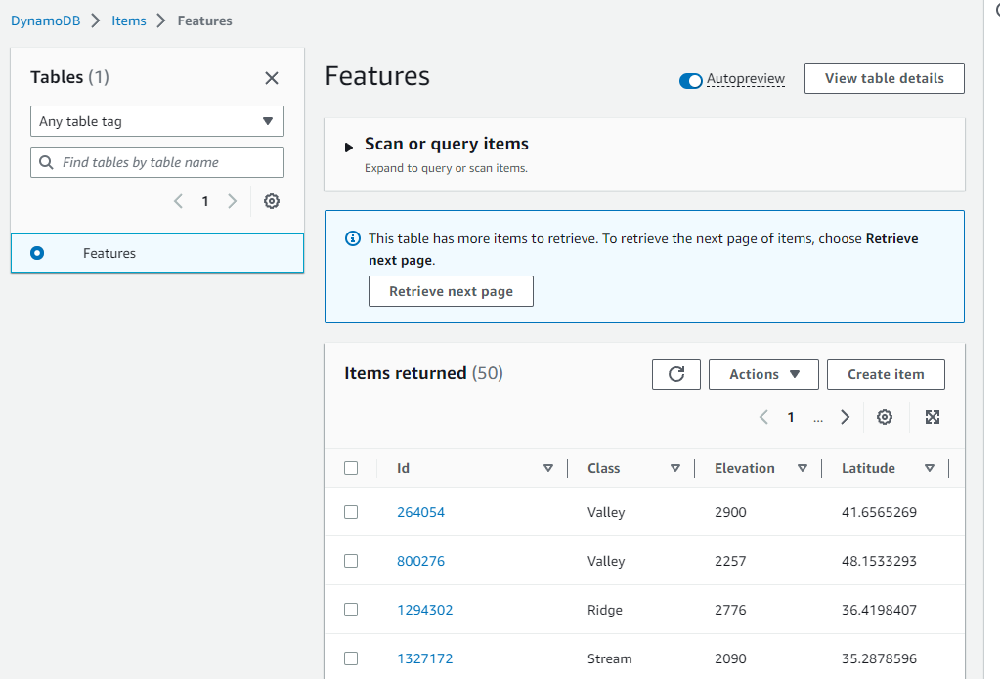
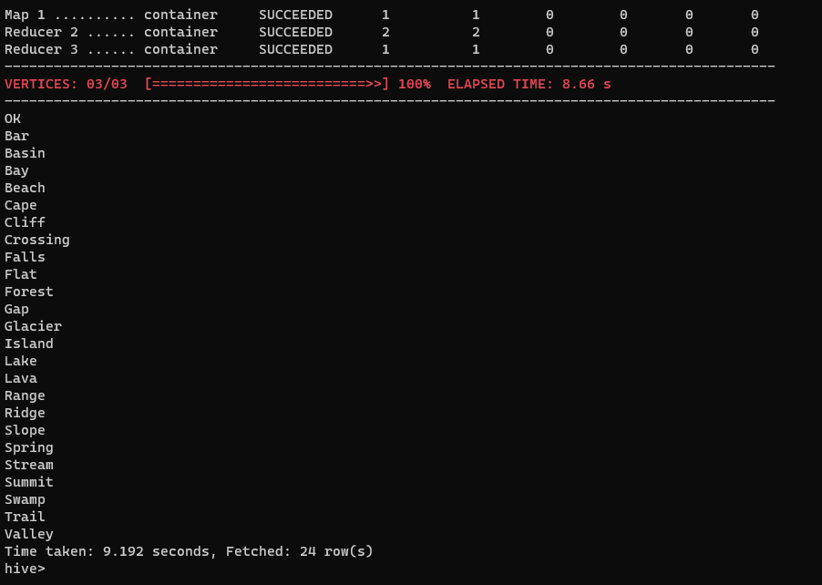
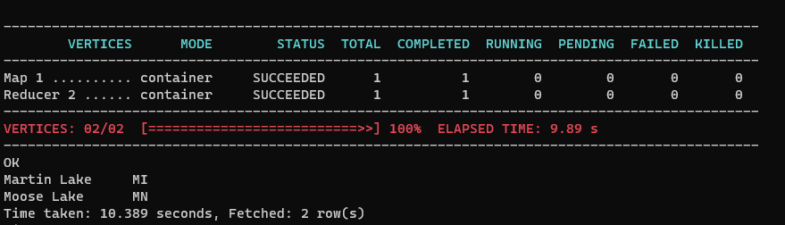
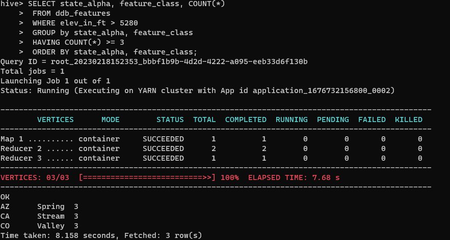

# Working with Amazon DynamoDB and Apache Hive
In this tutorial, you will launch an Amazon EMR cluster, and then use Apache Hive to process data stored in DynanmoDB table

Source: https://docs.aws.amazon.com/amazondynamodb/latest/developerguide/EMRforDynamoDB.Tutorial.html

## Hive
A data warehouse application for Hadoop that allows you to process and analyze data from multiple sources. Hive provides an SQL-like language, HiveQL, that lets you work with data stored locally in the Amazon EMR cluster or at an external data source (such as DynanmoDB)

## Step 1: Create an EC2 key pair

    aws ec2 create-key-pair \
    --key-name my-key-pair \
    --key-type rsa \
    --key-format pem \
    --query "KeyMaterial" \
    --output text > my-key-pair.pem

## Step 2: Launch an EMR Cluster

Use at least m5.xlarge compute in order to start cluster

    aws emr create-cluster \
    --name "My cluster" \
    --release-label "emr-6.9.0" \
    --service-role "arn:aws:iam::890533369032:role/EMR_DefaultRole" \
    --ec2-attributes '{"InstanceProfile":"EMR_EC2_DefaultRole","EmrManagedMasterSecurityGroup":"sg-0192646f33fa6b0fe","EmrManagedSlaveSecurityGroup":"sg-0192646f33fa6b0fe","KeyName":"emr-with-dynDB-kp","AdditionalMasterSecurityGroups":[],"AdditionalSlaveSecurityGroups":[],"SubnetId":"subnet-08222326f3c06cfc5"}' \
    --applications Name=Hadoop Name=Hive \
    --instance-groups '[{"InstanceCount":1,"InstanceGroupType":"MASTER","Name":"Primary","InstanceType":"m5.xlarge","EbsConfiguration":{"EbsBlockDeviceConfigs":[{"VolumeSpecification":{"VolumeType":"gp2","SizeInGB":32},"VolumesPerInstance":2}]}},{"InstanceCount":1,"InstanceGroupType":"TASK","Name":"Task - 1","InstanceType":"m5.xlarge","EbsConfiguration":{"EbsBlockDeviceConfigs":[{"VolumeSpecification":{"VolumeType":"gp2","SizeInGB":32},"VolumesPerInstance":2}]}},{"InstanceCount":1,"InstanceGroupType":"CORE","Name":"Core","InstanceType":"m5.xlarge","EbsConfiguration":{"EbsBlockDeviceConfigs":[{"VolumeSpecification":{"VolumeType":"gp2","SizeInGB":32},"VolumesPerInstance":2}]}}]' \
    --scale-down-behavior "TERMINATE_AT_TASK_COMPLETION" \
    --auto-termination-policy '{"IdleTimeout":3600}' \
    --os-release-label "2.0.20221210.1" \
    --region "us-west-2"

Note: Make sure to allow for SSH in the default EMR security group (SSH port 22). For the sake of simplicity, I placed this EMR cluster in the public subnet, connected directly to an internet gateway. However, this is not the best practice. In a production environment, to increase security, the cluster should be placed in the private subnet, connected to a NAT gateway on a public subnet of the same AZ. The NAT gateway then is connected to the internet gateway. This applies another layer of security but can incur costs since NAT gateway is not a free service

## Step 3: Connect to the leader node

    ssh -i "emr-with-dynDB-kp.pem" ec2-user@ec2-54-70-111-248.us-west-2.compute.amazonaws.com

To check its connection to the internet, I issued a "sudo yum update -y" command to update its softwares

## Step 4: Load data into HDFS

1. Download sample data:

        wget https://docs.aws.amazon.com/amazondynamodb/latest/developerguide/samples/features.zip

2. Unzip

        unzip features.zip

3. Preview the file

        head features.txt

4. Connect to Hive session

        sudo hive

5. Create an native Hive table

        CREATE TABLE hive_features
        (feature_id             BIGINT,
        feature_name            STRING ,
        feature_class           STRING ,
        state_alpha             STRING,
        prim_lat_dec            DOUBLE ,
        prim_long_dec           DOUBLE ,
        elev_in_ft              BIGINT)
        ROW FORMAT DELIMITED
        FIELDS TERMINATED BY '|'
        LINES TERMINATED BY '\n';

6. Load the table with data

        LOAD DATA
        LOCAL
        INPATH './features.txt'
        OVERWRITE
        INTO TABLE hive_features;

7. Verify that hive table is populated with data

        SELECT state_alpha, COUNT(*)
        FROM hive_features
        GROUP BY state_alpha;

## Step 5: Copy data to DynamoDB

In this step, you will copy data from the Hive table (hive_features) to a new table in DynamoDB.

1. Open the DynamoDB console at https://console.aws.amazon.com/dynamodb/.

2. Choose Create Table.

3. On the Create DynamoDB table page, do the following:

    a) In Table, type Features.

    b) For Primary key, in the Partition key field, type Id. Set the data type to Number.

    Clear Use Default Settings. For Provisioned Capacity, type the following:

        Read Capacity Units—10

        Write Capacity Units—10

    Choose Create.

4. At the Hive prompt, enter the following HiveQL statement:

        CREATE EXTERNAL TABLE ddb_features
            (feature_id   BIGINT,
            feature_name  STRING,
            feature_class STRING,
            state_alpha   STRING,
            prim_lat_dec  DOUBLE,
            prim_long_dec DOUBLE,
            elev_in_ft    BIGINT)
        STORED BY 'org.apache.hadoop.hive.dynamodb.DynamoDBStorageHandler'
        TBLPROPERTIES(
            "dynamodb.table.name" = "Features",
            "dynamodb.column.mapping"="feature_id:Id,feature_name:Name,feature_class:Class,state_alpha:State,prim_lat_dec:Latitude,prim_long_dec:Longitude,elev_in_ft:Elevation"
        );
You have now established a mapping between Hive and the Features table in DynamoDB.

5. Enter the following HiveQL statement to import data to DynamoDB:

        INSERT OVERWRITE TABLE ddb_features
        SELECT
            feature_id,
            feature_name,
            feature_class,
            state_alpha,
            prim_lat_dec,
            prim_long_dec,
            elev_in_ft
        FROM hive_features;
    Hive will submit a MapReduce job, which will be processed by your Amazon EMR cluster. It will take several minutes to complete the job.

6. Verify that the data has been loaded into DynamoDB:

    a) In the DynamoDB console navigation pane, choose Tables.

    b) Choose the Features table, and then choose the Items tab to view the data.

## Step 6: Query the data in the DynamoDB table

In this step, you will use HiveQL to query the Features table in DynamoDB. Try the following Hive queries:

1. All of the feature types (feature_class) in alphabetical order:

        SELECT DISTINCT feature_class
        FROM ddb_features
        ORDER BY feature_class;

2. All of the lakes that begin with the letter "M":

        SELECT feature_name, state_alpha
        FROM ddb_features
        WHERE feature_class = 'Lake'
        AND feature_name LIKE 'M%'
        ORDER BY feature_name;

3. States with at least three features higher than a mile (5,280 feet):

        SELECT state_alpha, feature_class, COUNT(*)
        FROM ddb_features
        WHERE elev_in_ft > 5280
        GROUP by state_alpha, feature_class
        HAVING COUNT(*) >= 3
        ORDER BY state_alpha, feature_class;

## Step 7: Clean up