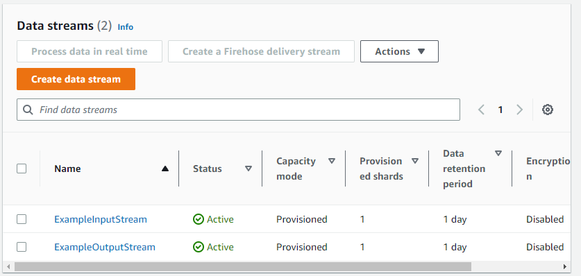
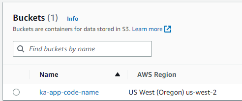
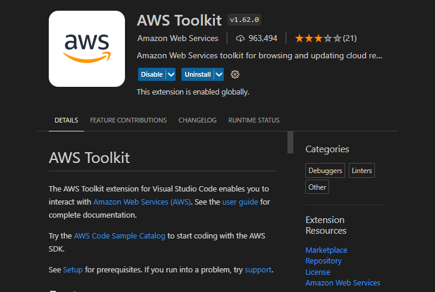
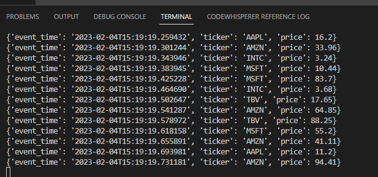
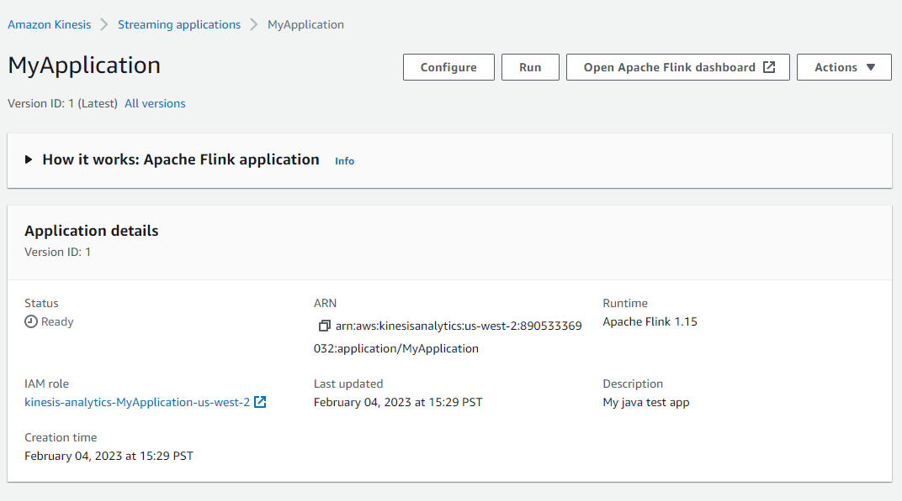
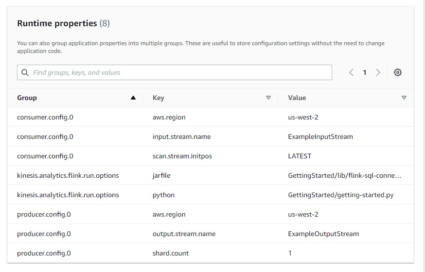
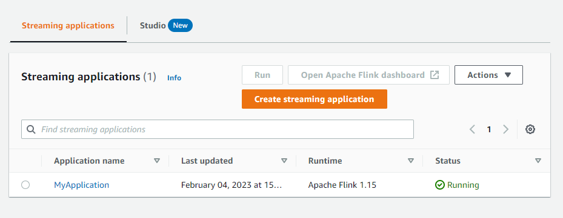

# Create and Run a Kinesis Data Analytics for Python Application
Source link: https://docs.aws.amazon.com/kinesisanalytics/latest/java/gs-python-createapp.html

In this exercise, you create a Kinesis Data Analytics application for Python application with a Kinesis stream as a source and a sink.

## This section contains the following steps.

1. Create Dependent Resources
2. Write Sample Records to the Input Stream
3. Create and Examine the Apache Flink Streaming Python Code
4. Upload the Apache Flink Streaming Python Code
5. Create and Run the Kinesis Data Analytics Application
6. Next Step

## 1. Create Dependent Resources
 + Two Kinesis streams for input and ouput
 + An S3 bucket to store application's code and output

(Before the below CLI even works, create IAM user with CLI access and log in as user in CLI with {aws configure --profile "adminuser"})

AWS CLI for InputStream

    $ aws kinesis create-stream \
    --stream-name ExampleInputStream \
    --shard-count 1 \
    --region us-west-2 \
    --profile adminuser
AWS CLI for OutputStream

    $ aws kinesis create-stream \
    --stream-name ExampleOutputStream \
    --shard-count 1 \
    --region us-west-2 \
    --profile adminuser

### Streams:

### S3 Bucket:
Created using the console

## 2. Write Sample Records to the Input Stream
stock.py

    import datetime
    import json
    import random
    import boto3

    STREAM_NAME = "ExampleInputStream"

    def get_data():
        return {
            'event_time': datetime.datetime.now().isoformat(),
            'ticker': random.choice(['AAPL', 'AMZN', 'MSFT', 'INTC', 'TBV']),
            'price': round(random.random() * 100, 2)}

    def generate(stream_name, kinesis_client):
        while True:
            data = get_data()
            print(data)
            kinesis_client.put_record(
                StreamName=stream_name,
                Data=json.dumps(data),
                PartitionKey="partitionkey")

    if __name__ == '__main__':
        generate(STREAM_NAME, boto3.client('kinesis', region_name='us-west-2'))

In order for this section to work, I installed the AWS VsCode Extension and logged in with my credentials

Afterword, the stock.py script runs successfully like below:

## 3. Create and Examine the Apache Flink Streaming Python Code

## 4. Upload the Apache Flink Streaming Python Code

a) Use your preferred compression application to compress the getting-started.py and https://mvnrepository.com/artifact/org.apache.flink/flink- sql-connector-kinesis_2.12/1.15.2 files. Name the archive myapp.zip. If you include the outer folder in your archive, you must include this in the path with the code in your configuration file(s): GettingStarted/getting-started.py.

b) Open the Amazon S3 console at https://console.aws.amazon.com/s3/.

c) Choose Create bucket.

d) Enter ka-app-code-<username> in the Bucket name field. Add a suffix to the bucket name, such as your user name, to make it globally unique. Choose Next.

    In the Configure options step, keep the settings as they are, and choose Next.

    In the Set permissions step, keep the settings as they are, and choose Next.

    Choose Create bucket.

e) In the Amazon S3 console, choose the ka-app-code-<username> bucket, and choose Upload.

    In the Select files step, choose Add files. Navigate to the myapp.zip file that you created in the previous step. Choose Next.

## 5. Create and Run the Kinesis Data Analytics Application

### Create the Application

Open the Kinesis Data Analytics console at https://console.aws.amazon.com/kinesisanalytics.

On the Kinesis Data Analytics dashboard, choose Create analytics application.

On the Kinesis Analytics - Create application page, provide the application details as follows:

For Application name, enter MyApplication.

For Description, enter My java test app.

For Runtime, choose Apache Flink.

Leave the version as Apache Flink version 1.15.2 (Recommended version).

For Access permissions, choose Create / update IAM role kinesis-analytics-MyApplication-us-west-2.

Choose Create application.

### Configure the Application

### Edit the IAM policy

Open the IAM console at https://console.aws.amazon.com/iam/.

Choose Policies. Choose the kinesis-analytics-service-MyApplication-us-west-2 policy that the console created for you in the previous section.

On the Summary page, choose Edit policy. Choose the JSON tab.

Add the highlighted section of the following policy example to the policy. Replace the sample account IDs (012345678901) with your account ID

    {
        "Version": "2012-10-17",
        "Statement": [
            {
                "Sid": "ReadCode",
                "Effect": "Allow",
                "Action": [
                    "s3:GetObject",
                    "s3:GetObjectVersion"
                ],
                "Resource": [
                    "arn:aws:s3:::ka-app-code-username/myapp.zip"
                ]
            },
            {
                "Sid": "DescribeLogGroups",
                "Effect": "Allow",
                "Action": [
                    "logs:DescribeLogGroups"
                ],
                "Resource": [
                    "arn:aws:logs:us-west-2:012345678901:log-group:*"
                ]
            },
            {
                "Sid": "DescribeLogStreams",
                "Effect": "Allow",
                "Action": [
                    "logs:DescribeLogStreams"
                ],
                "Resource": [
                    "arn:aws:logs:us-west-2:012345678901:log-group:/aws/kinesis-analytics/MyApplication:log-stream:*"
                ]
            },
            {
                "Sid": "PutLogEvents",
                "Effect": "Allow",
                "Action": [
                    "logs:PutLogEvents"
                ],
                "Resource": [
                    "arn:aws:logs:us-west-2:012345678901:log-group:/aws/kinesis-analytics/MyApplication:log-stream:kinesis-analytics-log-stream"
                ]
            },
            {
                "Sid": "ReadInputStream",
                "Effect": "Allow",
                "Action": "kinesis:*",
                "Resource": "arn:aws:kinesis:us-west-2:012345678901:stream/ExampleInputStream"
            },
            {
                "Sid": "WriteOutputStream",
                "Effect": "Allow",
                "Action": "kinesis:*",
                "Resource": "arn:aws:kinesis:us-west-2:012345678901:stream/ExampleOutputStream"
            }
        ]
    }

### Run the Application

