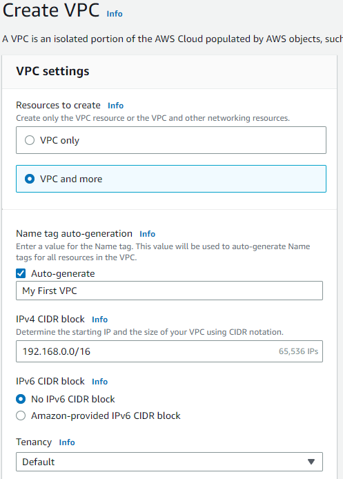
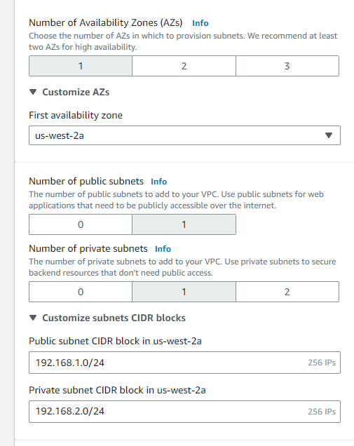
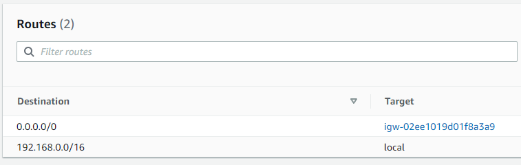
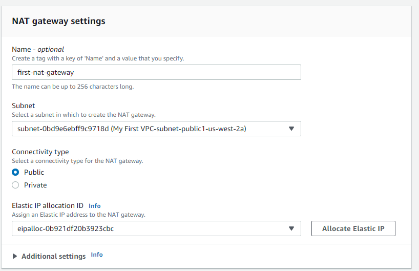
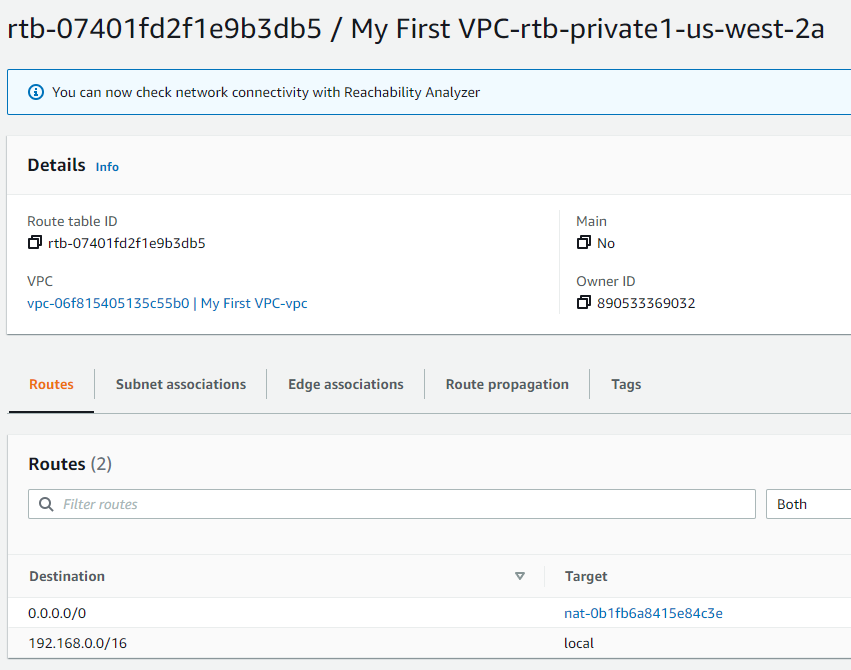
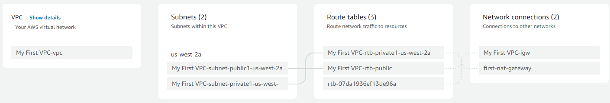
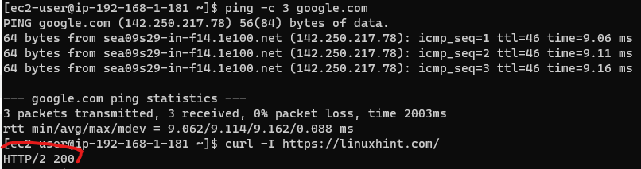

# VPC Basics
### Objective:
Build by own custom Amazon VPC and then deploy EC2 instances into it.

## Step 1: Create a custom Amazon VPC
a) Sign in to the AWS Management Console as an admin

b) Launch the VPC Dashboard

c) Create VPC with CIDR block equal to "192.168.0.0/16", default tenancy, and name tag "My First VPC"

## Step 2: Create Two Subnets
a) Create a subnet with CIDR block equal to "192.168.1.0/24" and name it "My First Public Subnet", specify an AZ

a) Create a subnet with CIDR block equal to "192.168.2.0/24" and name it "My First Private Subnet", specify an AZ

## Step 3: Connect VPC to the Internet and Establish Routing

a) Create an Amazon EC2 key pair in the same region as your VPC

b) Create an IGW and attach it to your VPC

c) Add to the main route table for your VPC that directs Internet traffic to the IGW

d) Create a NAT gateway, place it in the public subnet of your VPC, assign it an EIP

e) Create a new route table and place it within your VPC. Add a route to it that directs Internet traffic to the NAT gateway and associate it with the private subnet 

## Step 4: Launch an EC2 Instance and Test the Connection to the Internet

a) Launch a t2.micro Amazon Linux AMI as an EC2 instance into the public subnet of your custom VPC. Select the newly created key-pair for secure access to your instance 

(NOTE: Before being able to ssh, you have to allow TCP traffic from port 22 in the security group)

b) Securely access the EC2 instance via SSH

c) Test your internet connection

In this case, I pinged google.com and tested curl command (I had to allow HTTP outbound protocols in the security group though)

