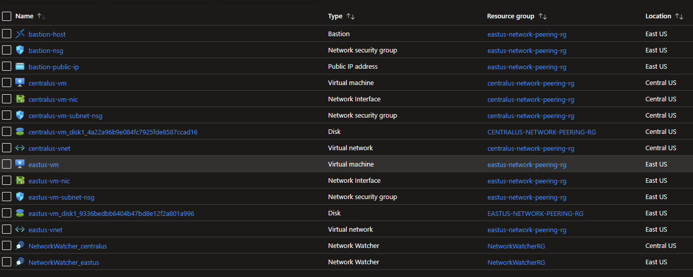
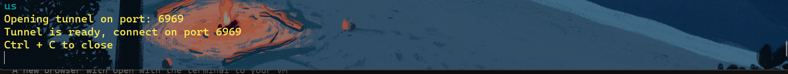

# Azure Virtual Network Peering with Terraform

## What is VNet Peering?

Virtual network peering enables you to connect two or more Virtual Networks in Azure.

Read more: https://learn.microsoft.com/en-us/azure/virtual-network/virtual-network-peering-overview

## Project Goal

In this project, I will set up a VM in Central US that is only accessible via ssh connection, though peering, from a VM in East US. The VM is East US is accessible for ssh over the internet via Bastion Tunneling.

Read more:
[How to up Bastion with Terraform](https://github.com/antnguyen72/Personal-Projects/tree/main/Cloud/Azure/azure-bastion)

## Project Components

I will set up the following (similar to diagram below) with Terraform:

    _Region: East US
        Virtual Network
            Azure Bastion Subnet
                Azure Bastion Host
            VM Subnet
                east-us-VM
    
    _Region: Central US
        Virtual Network
            VM Subnet
                central-us-VM

Network Security Group for each subnet allow only necessary connection (see terraform file for more details).

Note!: SSH is a two-way connection. So you will need to allow both outbound and inbound TCP connections from each Subnet to the other via port 22.

Powershell scripting is used to automate the deployment process. With Powershell, I was able to build out dependecies and speed up the deployment process with parallelization.

## Steps:

1. With PowerShell Terminal, run apply.ps1 deploy resources (Maybe take up to 15 minutes, Bastion takes a while to set up):
    
        .\apply.ps1

    

2. Wait for Resource to deploy, then run tunnel.ps1 to establish Bastion tunneling. This allows for ssh connection to East US VM from your computer:

        .\tunnel.ps1
    
    

3. On a new Terminal Window, test ssh connection to East US VM (Use your preferrred method of authentication, I used password):

        ssh anguyen@127.0.0.1 -p 6969

        # Note: 127.0.0.1 is Azure's IP. Literally SSH to this.
    
    

4. Test ssh connection from East US VM to Central US VM:

        ssh anguyen@<Central-US-VM-IP>
    
    

5. Clean up your cloud resources:

        .\destroy.ps1
    
    

# Done!