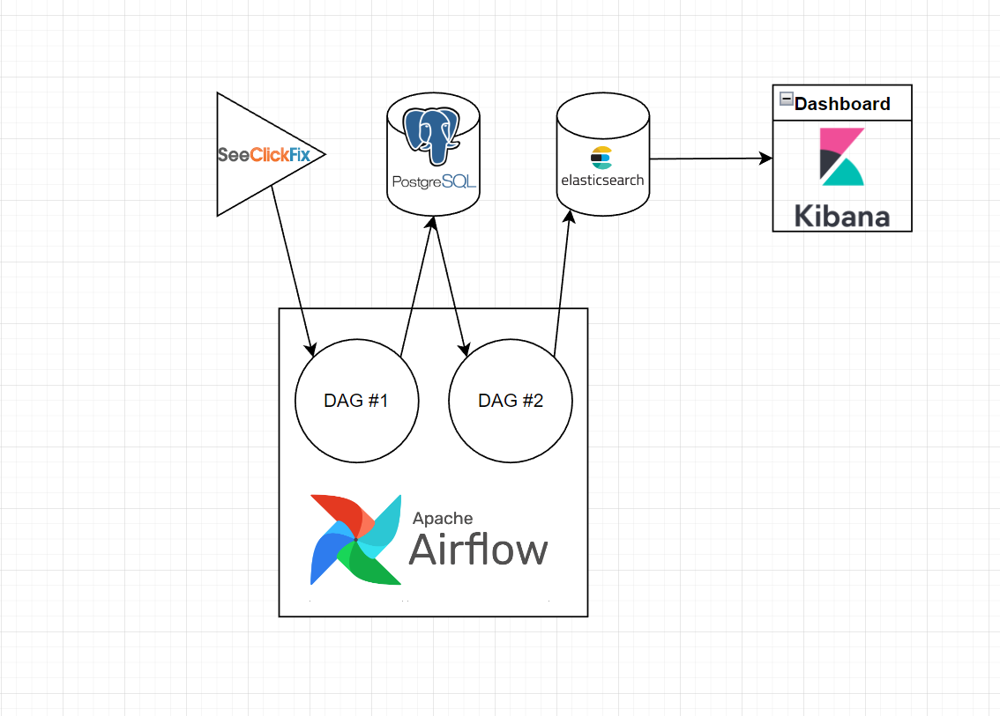

# SeeClickFix API data updated daily for real-time dashboard

### Languages used:
Python, SQL  
 

### Other tools used:
Apache Airflow, Elasticsearch + Kibana, Postgresql + PGAdmin4, Linux + Docker  
 

### Setup:
For my setup, I installed linux on two mini PC's and used a RasberryPi(I had to go and get another pc because elasticsearch takes up alot of computing power)

 - PC1: intel i7 6 cores, 8Gb RAM:
    Dockerized Apache Airflow and PGAdmin4
 
 - PC2: intel i5 4 cores, 16Gb RAM:
    Dockeredized Elasticsearch and Kibana

 - Raspberrypi4: 4Gb RAM:
    Dockerized Postgresql

I wanted to use the raspberrypi4 to simulate multiple devices environment.
The actual setting up of the environment took up 70% the time of this project. I decided to go with Docker because allowed me to set up clean environments that can be spun up/down anytime (see more in ./Environment Setup)

### Flowchart:

In this project, I used the ETL method to extract daily data from Seelickfix api, transform them before loading it into postgreSQL for storage, before transferring them again to elastic search, where a dash board can be created with Kibana

 - Extract: 
    + Call SeeClickFix api for civil complaints in the county of Santa Clara, California

 - Transform:
    + Normalize date: split datetime data into date and time. New column for date only (the api gives the same time stamp)
    + Extract zip code: rename address column and create a new column for zip code
    + Coordinate: convert long/lat data into geohash
    + Final columns: 'id','summary','description','rating','full_address','html_url','date','time','zip_code','coordinate'

 - Load:
    + Create table in Postgresql with ID as the primary key
    + Query result into table
    + Load data from table into elastic search

 - Dashboard:
    + Create vertical bar chart, pie chart, and geo location map with Kibana

### Problems, solutions, and lessons:

There were problems at every step of this project. Originally, this project is presented to by a book I am reading (Data Engineering with Python by Paul Crickard). The author suggested the use of Apache Nifi for pipeline orchestration. However, I liked coding more than the Nifi GUI, so I decided to freestyle the project, trying to achieve the same goal but with Apache Airflow.

 - Docker: had trouble with setting up containers. Lessons learned: learned how to write/edit my own docker-compose.yaml files. Learned how to bash into containers to set up dependencies/edit files (though I learned later that you can just sync directories...)

 - Linux: trouble with networking and permission management. Lessons learned: how to open ports for commmunications, how to set up directories with the correct permissions so that programs can run correctly

 - SeeClickFix api: the API would restamp civil complaint tickets with the most current date. This caused a problem for my timestamping. However, I resolved this by making the ID the primary key. That way, my database will only receive new tickets only. Lesson learned: importance of data exploratory analysis

 - Apache Airflow: this was a total nightmare to set up. This alone took me an entire week. However, seeing that first dag run successfully made it all worth it. Lessons learned: similar to docker, I had to edit the docker-compose.yaml extensively so it would work. Lesson learned: READ DOCUMENTATION UNTIL YOUR BRAIN GIVES UP AND THEN TRY AGAIN THE NEXT DAY

  - PostgreSQL: this was the easiest part of the setup. PGAdmin and the actual db were very easy to set up and did not gave many errors. Though, I had an error where my db was not being callable. I posted on stackoverflow and learned that I would have to open up the tcp port of the db. Lesson learned: opening up network ports

  - elastichsearch: elastic was also very sensitive to set up. It requires a large amount of resouce (relatively) to run. I went ahead and bought a small PC just to host this. However, this is a good investment since I plan on tackling the hadoop ecosystem and experiment with kafka streaming next. Lessoon learned: noSQL database (document style db) that relies on indices. How to format data for Kibana

  - Kibana: kibana and elastic are the same beast...both hard to set up. But once I got it working, it is a very powerful tool. Lesson learned: normalizing data with dashboard end-result in mind. Once I got to making the dashboard, I had to rewrite all the codes so that the end result could be prettier. I learned to geohash coordinates with pyohash. The geohash data can be displayed on a map offered by kibana

### Dashboard screenshots:

### Docker setup:

### Comments and final remarks:

I learned so so so much from this process. Though the end result is not pretty. I now have a dashboard that updates daily about the civil complains from my area. However, the SeeClickFix API is not very active in my area so there's no new entry point everyday...I learned so much about everything and am more confident going into my next project

For my next project, I would like to set up a hadoop ecosystem (HDFS, hue, hive, spark) that will process data from a stream such as kafka
